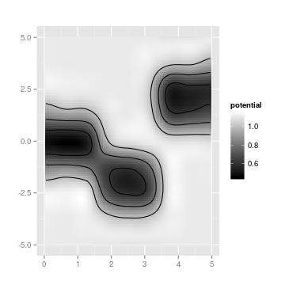
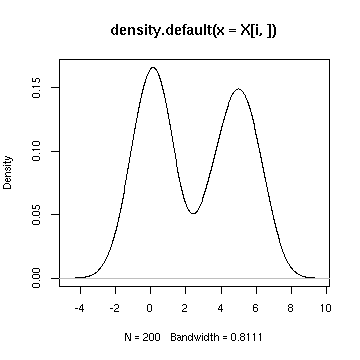

<!--
  %\VignetteEngine{knitr::rmarkdown}
  %\VignetteIndexEntry{microbiome tutorial}
  %\usepackage[utf8]{inputenc}
-->


earlywarnings R package
===========

## Installation

### Installing and loading the release version

Note: if dependencies are missing you may wish to run the [../installation.script](installation.script) first


```r
install.packages("earlywarnings")
```

### Installing and loading the experimental development version


```r
library(devtools)
install_github("earlywarningtoolbox/earlywarnings-R/earlywarnings")
```

### Clone the repository & install locally:

Run on command line:
<pre><code>git clone git@github.com:earlywarningtoolbox/earlywarnings-R.git
./build.sh
</pre></code>

### Loading the package


```r
library(earlywarnings)  
```


## Potential analysis

Potential analysis, used for instance in [Hirota et al. Science, 334, 232-235.](http://www.sciencemag.org/content/334/6053/232.long)


```r
# Create simulated example data
X <- c(rnorm(1000, mean = 0), rnorm(1000, mean = -2), 
 	           rnorm(1000, mean = 2))
param <- seq(0,5,length=3000) 

# Run potential analysis
res <- movpotential_ews(X, param)

# Visualize
p <- PlotPotential(res$res, title = '', 
	       	   xlab.text = '', ylab.text = '', 
		   cutoff = 0.5, plot.contours = TRUE, binwidth = 0.2)
print(p)
```

 

## Multimodality detection

Estimate multimodality score and number of modes based on bootstrapped potential analysis.


```r
# Potential analysis with bootstrap
library(earlywarnings)

# Example Data
X <- as.matrix(rbind(c(rnorm(100, mean = 0), rnorm(100, mean = 5)), 
           c(rnorm(200, mean = 0))))
m <- multimodality_score(X, detection.threshold = 1, bs.iterations = 20, detection.limit = 3)
```

```
## Error in eval(expr, envir, enclos): could not find function "multimodality_score"
```

```r
# Plot the original data for feature i 
# together with the estimated density maxima and minima
i <- 1
plot(density(X[i,])); 
```

 

```r
abline(v = m$results[[i]]$maxima)
```

```
## Error in int_abline(a = a, b = b, h = h, v = v, untf = untf, ...): object 'm' not found
```

```r
abline(v = m$results[[i]]$minima, lty = 2)
```

```
## Error in int_abline(a = a, b = b, h = h, v = v, untf = untf, ...): object 'm' not found
```


### Licensing and Citations

This work can be freely used, modified and distributed under the 
[Two-clause (Free)BSD license](http://en.wikipedia.org/wiki/BSD\_licenses).

Kindly cite the work as 'Vasilis Dakos and Leo Lahti (2014). earlywarnings R package. URL: https://github.com/earlywarningtoolbox/earlywarnings-R/tree/master/earlywarnings'.


```r
citation("earlywarnings")
```

```
## It is recommended to use 'given' instead of 'first'.
## It is recommended to use 'family' instead of 'last'.
## It is recommended to use 'given' instead of 'first'.
## It is recommended to use 'family' instead of 'last'.
```

```
## 
## To cite earlywarnings in publications use:
## 
##   Vasilis Dakos et al. Methods for detecting early warnings of
##   critical transitions in time series illustrated using simulated
##   ecological dataPLoS One 7(7):e41010, 2012. See
##   http://www.plosone.org/article/info%3Adoi%2F10.1371%2Fjournal.pone.0041010
## 
## A BibTeX entry for LaTeX users is
## 
##   @Article{,
##     title = {R Early Warning Signals Toolbox},
##     author = {Vasilis Dakos and Leo Lahti},
##     journal = {The R Project for Statistical Computing},
##     year = {2013},
##     note = {http://cran.r-project.org/web/packages/earlywarnings/index.html},
##     url = {Publication URL here},
##   }
```

### Session info

This vignette was created with


```r
sessionInfo()
```

```
## R version 3.2.0 (2015-04-16)
## Platform: x86_64-unknown-linux-gnu (64-bit)
## Running under: Ubuntu 14.10
## 
## locale:
##  [1] LC_CTYPE=en_US.UTF-8       LC_NUMERIC=C              
##  [3] LC_TIME=en_US.UTF-8        LC_COLLATE=en_US.UTF-8    
##  [5] LC_MONETARY=en_US.UTF-8    LC_MESSAGES=en_US.UTF-8   
##  [7] LC_PAPER=en_US.UTF-8       LC_NAME=C                 
##  [9] LC_ADDRESS=C               LC_TELEPHONE=C            
## [11] LC_MEASUREMENT=en_US.UTF-8 LC_IDENTIFICATION=C       
## 
## attached base packages:
## [1] stats     graphics  grDevices utils     datasets  methods   base     
## 
## other attached packages:
## [1] earlywarnings_1.0.59 tseries_0.10-34      tgp_2.4-11          
## [4] moments_0.14         ggplot2_1.0.1        knitr_1.9           
## 
## loaded via a namespace (and not attached):
##  [1] Rcpp_0.11.5        cluster_2.0.1      maps_2.3-9        
##  [4] MASS_7.3-40        nortest_1.0-3      Kendall_2.2       
##  [7] munsell_0.4.2      som_0.3-5          colorspace_1.2-6  
## [10] lattice_0.20-31    quadprog_1.5-5     stringr_0.6.2     
## [13] plyr_1.8.2         fields_8.2-1       tools_3.2.0       
## [16] grid_3.2.0         spam_1.0-1         gtable_0.1.2      
## [19] KernSmooth_2.23-14 lmtest_0.9-33      digest_0.6.8      
## [22] reshape2_1.4.1     formatR_1.2        rpart_4.1-9       
## [25] evaluate_0.7       maptree_1.4-7      labeling_0.3      
## [28] scales_0.2.4       boot_1.3-16        proto_0.3-10      
## [31] zoo_1.7-12
```


