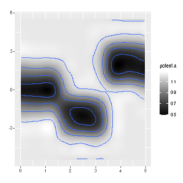

<!--
  %\VignetteEngine{knitr::rmarkdown}
  %\VignetteIndexEntry{microbiome tutorial}
  %\usepackage[utf8]{inputenc}
-->


earlywarnings R package
===========

## Installation

### Installing and loading the release version

Note: if dependencies are missing you may wish to run the [../installation.script](installation.script) first


```r
install.packages("earlywarnings")
```

### Installing and loading the experimental development version


```r
library(devtools)
install_github("earlywarningtoolbox/earlywarnings-R/earlywarnings")
```

### Clone the repository & install locally:

Run on command line:
<pre><code>git clone git@github.com:earlywarningtoolbox/earlywarnings-R.git
./build.sh
</pre></code>

### Loading the package


```r
library(earlywarnings)  
```


## Potential analysis

Potential analysis, used for instance in [Hirota et al. Science, 334, 232-235.](http://www.sciencemag.org/content/334/6053/232.long)


```r
# Create simulated example data
X <- c(rnorm(1000, mean = 0), rnorm(1000, mean = -2), 
 	           rnorm(1000, mean = 2))
param <- seq(0,5,length=3000) 

# Run potential analysis
res <- movpotential_ews(X, param)

# Visualize
p <- PlotPotential(res$res, title = '', 
	       	   xlab.text = '', ylab.text = '', 
		   cutoff = 0.5, plot.contours = TRUE, binwidth = 0.2)
print(p)
```




### Licensing and Citations

This work can be freely used, modified and distributed under the 
[Two-clause (Free)BSD license](http://en.wikipedia.org/wiki/BSD\_licenses).

Kindly cite the work as 'Vasilis Dakos and Leo Lahti (2014). earlywarnings R package. URL: https://github.com/earlywarningtoolbox/earlywarnings-R/tree/master/earlywarnings'.


```r
citation("earlywarnings")
```

```
## Warning in person1(given = given[[i]], family = family[[i]], middle =
## middle[[i]], : It is recommended to use 'family' instead of 'last'.

## Warning in person1(given = given[[i]], family = family[[i]], middle =
## middle[[i]], : It is recommended to use 'family' instead of 'last'.
```

```
## 
## To cite earlywarnings in publications use:
## 
## 
## 
## 
## 
## To see these entries in BibTeX format, use 'print(<citation>,
## bibtex=TRUE)', 'toBibtex(.)', or set
## 'options(citation.bibtex.max=999)'.
```

### Session info

This vignette was created with


```r
sessionInfo()
```

```
## R version 4.2.0 (2022-04-22)
## Platform: x86_64-pc-linux-gnu (64-bit)
## Running under: Ubuntu 22.04 LTS
## 
## Matrix products: default
## BLAS:   /home/xxx/bin/R-4.2.0/lib/libRblas.so
## LAPACK: /home/xxx/bin/R-4.2.0/lib/libRlapack.so
## 
## locale:
##  [1] LC_CTYPE=en_US.UTF-8       LC_NUMERIC=C              
##  [3] LC_TIME=en_US.UTF-8        LC_COLLATE=en_US.UTF-8    
##  [5] LC_MONETARY=en_US.UTF-8    LC_MESSAGES=en_US.UTF-8   
##  [7] LC_PAPER=en_US.UTF-8       LC_NAME=C                 
##  [9] LC_ADDRESS=C               LC_TELEPHONE=C            
## [11] LC_MEASUREMENT=en_US.UTF-8 LC_IDENTIFICATION=C       
## 
## attached base packages:
## [1] stats     graphics  grDevices utils     datasets  methods   base     
## 
## other attached packages:
## [1] earlywarnings_1.1.28 tseries_0.10-51      tgp_2.4-18          
## [4] moments_0.14.1       ggplot2_3.3.6       
## 
## loaded via a namespace (and not attached):
##  [1] spam_2.8-0         zoo_1.8-10         tidyselect_1.1.2   nortest_1.0-4     
##  [5] xfun_0.31          maptree_1.4-8      purrr_0.3.4        lattice_0.20-45   
##  [9] colorspace_2.0-3   vctrs_0.4.1        generics_0.1.2     viridisLite_0.4.0 
## [13] utf8_1.2.2         rlang_1.0.2        isoband_0.2.5      pillar_1.7.0      
## [17] glue_1.6.2         withr_2.5.0        DBI_1.1.3          TTR_0.24.3        
## [21] lifecycle_1.0.1    quantmod_0.4.20    stringr_1.4.0      fields_13.3       
## [25] dotCall64_1.0-1    munsell_0.5.0      gtable_0.3.0       evaluate_0.15     
## [29] labeling_0.4.2     knitr_1.39         lmtest_0.9-40      curl_4.3.2        
## [33] fansi_1.0.3        highr_0.9          xts_0.12.1         KernSmooth_2.23-20
## [37] scales_1.2.0       som_0.3-5.1        farver_2.1.0       gridExtra_2.3     
## [41] Kendall_2.2.1      digest_0.6.29      stringi_1.7.6      dplyr_1.0.9       
## [45] grid_4.2.0         quadprog_1.5-8     cli_3.3.0          tools_4.2.0       
## [49] magrittr_2.0.3     maps_3.4.0         tibble_3.1.7       cluster_2.1.3     
## [53] crayon_1.5.1       pkgconfig_2.0.3    ellipsis_0.3.2     assertthat_0.2.1  
## [57] viridis_0.6.2      R6_2.5.1           rpart_4.1.16       boot_1.3-28       
## [61] compiler_4.2.0
```


